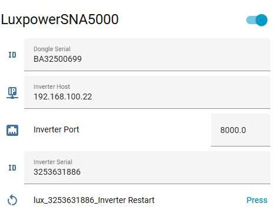

# LuxPower SNA – ESPHome Component

[](https://esphome.io)
[](LICENSE)
[](https://github.com/paulsteigel/luxpower_sna)

An ESPHome external component for monitoring and controlling **LuxPower SNA/SNA-G2 inverters** directly from an ESP32, without requiring a Home Assistant server or MQTT broker.

Designed for locations (such as parts of Vietnam) where ISPs assign non-public WAN IPs, making port forwarding impossible for the official Python integration.

---

## ✨ Features
Here are some snapshots of the control views:


- **Full read access** to all inverter sensor banks (0–4: live, daily, total, BMS, generator)
- **Write support** — switches, numbers, and buttons to control the inverter
- **Runtime configuration** — set host IP and serial numbers from HA UI without reflashing
- **IDF & Arduino compatible** — uses lwip sockets directly, no WiFiClient dependency
- **Persistent TCP connection** — mirrors the official Python integration behaviour; handles heartbeats automatically
- **State machine polling** — non-blocking, no `delay()`, safe on single-core ESP32-S2
- **Auto-reconnect** — reconnects on connection drop with 10s retry

---

## 📋 Requirements

- ESP32 (any variant: S2, S3, classic, C3…)
- ESPHome **2024.5+**
- LuxPower SNA / SNA-G2 inverter with WiFi dongle on local network

---

## 🚀 Quick Start

### 1. Add external component

```yaml
external_components:
  - source: github://paulsteigel/luxpower_sna@main
    refresh: 0s
```

### 2. Declare the hub

```yaml
luxpower_sna:
  id: lux_hub
  host: "192.168.1.100"        # Dongle IP (or leave blank for runtime config)
  port: 8000
  dongle_serial: "BA12345678"  # Exactly 10 characters
  inverter_serial: "3253631886" # Exactly 10 characters
  update_interval: 20s         # READ_INPUT polling interval
  hold_update_interval: 60s    # READ_HOLD refresh interval (switches/numbers)
```

### 3. Add sensors, switches, numbers

See [`luxpower_package.yaml`](luxpower_package.yaml) for a full working example.

---

## ⚙️ Runtime Configuration (no reflash needed)


Leave `host`/`dongle_serial`/`inverter_serial` blank in YAML and set them at runtime via HA UI or web_server. Values are stored in ESP32 flash (NVS) and survive reboots.

```yaml
luxpower_sna:
  id: lux_hub
  update_interval: 20s
  hold_update_interval: 60s

text:
  - platform: template
    id: lux_config_host
    name: "Inverter Host"
    entity_category: config
    mode: text
    optimistic: true
    restore_value: true
    initial_value: ""
    on_value:
      then:
        - lambda: |-
            id(lux_hub).set_host(x);
            if (id(lux_hub).is_config_ready()) id(lux_hub).reconnect();
```

---

## 📡 Supported Platforms

| Platform | Description |
|----------|-------------|
| `sensor` | All numeric sensors (voltage, power, energy, temperature…) |
| `text_sensor` | Status text, battery status (defined inside `sensor:` block) |
| `switch` | Bitmask-based hold register switches (reg 21, 110, 179) |
| `number` | Hold register number entities (charge rate, SOC limit, voltage…) |
| `button` | Inverter restart, reset all settings |

---

## 🔀 Switch Reference (Register 21 bitmasks)

| Key | Description | Bitmask |
|-----|-------------|---------|
| `normal_or_standby` | Normal / Standby mode | 0x0200 |
| `ac_charge_enable` | AC Charge Enable | 0x0080 |
| `feed_in_grid` | Feed In Grid | 0x8000 |
| `charge_priority` | Charge Priority | 0x0800 |
| `power_backup_enable` | Power Backup Enable | 0x0001 |
| `seamless_eps_switching` | Seamless EPS Switching | 0x0100 |
| `forced_discharge_enable` | Force Discharge Enable | 0x0400 |
| `charge_last` | Charge Last (reg 110) | 0x0010 |
| `enable_peak_shaving` | Grid Peak Shaving (reg 179) | 0x0080 |

---

## 🔢 Number Reference

| Key | Register | Unit | Divisor |
|-----|----------|------|---------|
| `charge_power_percent` | 64 | % | 1 |
| `discharge_power_percent` | 65 | % | 1 |
| `ac_charge_power_percent` | 66 | % | 1 |
| `ac_charge_soc_limit` | 67 | % | 1 |
| `discharge_cutoff_soc` | 105 | % | 1 |
| `charge_voltage` | 99 | V | 10 |
| `discharge_cutoff_voltage` | 100 | V | 10 |
| `ct_clamp_offset` | 119 | W | 10 (signed) |
| `grid_peak_shaving_power` | 206 | kW | 10 |

---

## 🗂️ Sensor Banks

| Bank | Registers | Contents |
|------|-----------|----------|
| 0 | 0–39 | Live: PV voltage/power, battery, grid, EPS, daily energy |
| 1 | 40–79 | Totals: lifetime energy counters, fault/warning codes, temperature, uptime |
| 2 | 80–119 | BMS: cell voltage/temp, battery status, current, capacity |
| 3 | 120–159 | Generator input, EPS L1/L2 |
| 4 | 160–199 | On-grid load power, daily/total load energy |

---

## 🔧 Troubleshooting

| Symptom | Likely cause | Fix |
|---------|-------------|-----|
| No data, connection refused | Wrong IP or port | Check dongle IP in router DHCP |
| CRC mismatch errors | Serial numbers wrong | Verify 10-char dongle + inverter serial |
| Values 10× too high (BMS current) | Model uses /100 scale | Change `/10.0f` → `/100.0f` in cpp |
| Entity not found after OTA | Slug changed | Check `name:` field — slug = lowercase + underscores |

---

## 📦 File Structure

```
luxpower_sna/
  __init__.py       # Hub component registration
  luxpower_sna.h    # C++ class declarations
  luxpower_sna.cpp  # C++ implementation
  sensor.py         # Sensor + text_sensor platform
  switch.py         # Switch platform
  number.py         # Number platform
  button.py         # Button platform
  time.py           # Time-slot helper (AC charge, force discharge)
```

---

## 🙏 Credits

- [guybw/LuxPython_DEV](https://github.com/guybw/LuxPython_DEV) — original Python HA integration, protocol documentation and register map
- [syssi/esphome-jk-bms](https://github.com/syssi/esphome-jk-bms) — ESPHome component architecture reference

---

## 📄 License

MIT — use at your own risk. Not affiliated with LuxPower.
