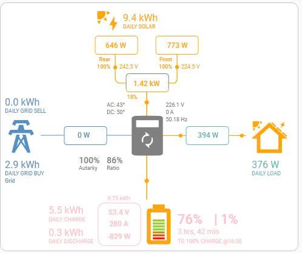

# LuxPower SNA – ESPHome Component

[](https://esphome.io)
[](LICENSE)
[](https://github.com/paulsteigel/luxpower_sna)

Component ESPHome để giám sát và điều khiển **biến tần LuxPower SNA/SNA-G2** trực tiếp từ ESP32, không cần Home Assistant server hay MQTT broker.

Thiết kế đặc biệt cho người dùng ở các khu vực (như Việt Nam) mà ISP phân phát IP WAN nội bộ, khiến port forwarding không khả thi với integration Python gốc.

---

## ✨ Tính năng

- **Đọc đầy đủ** tất cả sensor bank 0–4 (live, daily, total, BMS, generator)
- **Ghi dữ liệu** — switch, number, button để điều khiển biến tần
- **Tự động tìm dongle** — nhấn nút *Scan Dongle IP*, ESP32 quét /24 subnet, tìm dongle, kết nối ngay và lưu IP vào NVS nội bộ — tự động hoạt động sau mọi lần reboot
- **Cấu hình runtime** — đặt serial number từ HA UI mà không cần flash lại
- **Tương thích IDF** — dùng lwip socket trực tiếp, không phụ thuộc WiFiClient, chạy tốt trên ESP32-S2 single-core
- **Kết nối TCP bền vững** — giống Python integration gốc, tự xử lý heartbeat
- **State machine polling** — non-blocking, không có `delay()`, an toàn trên single-core
- **Tự động kết nối lại** — reconnect khi mất kết nối, retry sau 10 giây

Một số giao diện điều khiển:


Giao diện Lovelace — sao chép `lovelace.yaml` và thay tên entity:



---

## 📋 Yêu cầu

- ESP32 (bất kỳ biến thể: S2, S3, classic, C3…)
- ESPHome **2026.2+**
- Biến tần LuxPower SNA / SNA-G2 có WiFi dongle trên cùng mạng LAN

---

## 🚀 Bắt đầu nhanh

### 1. Thêm external component

```yaml
external_components:
  - source: github://paulsteigel/luxpower_sna@main
    refresh: 0s
```

### 2. Khai báo hub

```yaml
luxpower_sna:
  id: lux_hub
  host: "192.168.1.100"         # IP của dongle — hoặc để trống và dùng nút Scan
  port: 8000
  dongle_serial: "BA12345678"   # Đúng 10 ký tự
  inverter_serial: "1234567890" # Đúng 10 ký tự
  update_interval: 20s          # Chu kỳ đọc READ_INPUT
  hold_update_interval: 60s     # Chu kỳ refresh READ_HOLD (switch/number)
```

### 3. Thêm sensor, switch, number

Xem file [`luxpower_package.yaml`](luxpower_package.yaml) để có ví dụ đầy đủ.

---

## ⚙️ Cấu hình runtime (không cần flash lại)

Để trống `host`, `dongle_serial`, `inverter_serial` trong YAML và cấu hình từ HA UI.

**Host IP** được lưu trong NVS nội bộ của component — độc lập hoàn toàn với MQTT và HA state. Sau khi đặt (thủ công hoặc qua Scan), nó tồn tại qua reboot và MQTT reconnect mà không cần cấu hình thêm.

**Serial number** lưu trong ESPHome flash qua `restore_value: true`. Một `interval` watchdog đẩy chúng vào hub sau boot, trước khi MQTT kịp ghi đè.

```yaml
luxpower_sna:
  id: lux_hub
  update_interval: 20s
  hold_update_interval: 60s

text:
  - platform: template
    id: lux_config_host
    name: "${luxid}_Inverter Host"
    entity_category: config
    mode: text
    optimistic: true
    restore_value: true
    initial_value: ""
    on_value:
      then:
        - lambda: |-
            if (x.empty()) return;
            id(lux_hub).set_host(x);           # tự động lưu NVS
            if (id(lux_hub).is_config_ready()) id(lux_hub).reconnect();

  - platform: template
    id: lux_config_dongle
    name: "${luxid}_Dongle Serial"
    entity_category: config
    mode: text
    optimistic: true
    restore_value: true
    initial_value: ""
    on_value:
      then:
        - lambda: |-
            if (x.size() != 10) return;
            id(lux_hub).set_dongle_serial(x);
            if (id(lux_hub).is_config_ready()) id(lux_hub).reconnect();

  - platform: template
    id: lux_config_inverter
    name: "${luxid}_Inverter Serial"
    entity_category: config
    mode: text
    optimistic: true
    restore_value: true
    initial_value: ""
    on_value:
      then:
        - lambda: |-
            if (x.size() != 10) return;
            id(lux_hub).set_inverter_serial(x);
            if (id(lux_hub).is_config_ready()) id(lux_hub).reconnect();

# Watchdog: đẩy serial vào hub sau boot (host được NVS xử lý tự động)
interval:
  - interval: 2s
    then:
      - lambda: |-
          if (id(lux_hub).is_config_ready()) return;
          auto dongle   = id(lux_config_dongle).state;
          auto inverter = id(lux_config_inverter).state;
          if (dongle.size() == 10)   id(lux_hub).set_dongle_serial(dongle);
          if (inverter.size() == 10) id(lux_hub).set_inverter_serial(inverter);
          if (id(lux_hub).is_config_ready()) id(lux_hub).reconnect();
```

> **Lưu ý:** Entity UI `Inverter Host` chỉ dùng để nhập thủ công. Khi dùng Scan Dongle IP, host được lưu trực tiếp vào NVS nội bộ của component — UI entity không được cập nhật, nhưng component kết nối và tự phục hồi sau reboot hoàn toàn tự động.

---

## 🔍 Tự động tìm IP Dongle (Scan Dongle IP)

Nếu không biết IP của dongle, dùng nút **Scan Dongle IP**. ESP32 sẽ quét 254 địa chỉ trên /24 subnet, kết nối thử từng địa chỉ trên port đã cấu hình (mặc định 8000), và tự kết nối khi tìm thấy.

### Điều kiện trước khi scan

`dongle_serial` và `inverter_serial` phải được điền trước. Trường host có thể để trống.

### Cách hoạt động

1. Nhấn **Scan Dongle IP** trong HA hoặc web interface.
2. Component khởi động một FreeRTOS task chạy nền — main loop không bị block.
3. Các địa chỉ được kiểm tra tuần tự, mỗi lần một socket (an toàn khi chia sẻ lwip pool với các component khác).
4. Trên mạng /24 thông thường, scan hoàn tất trong **dưới 15 giây**.
5. Khi tìm thấy dongle:
   - Sensor `scan_status_text` hiển thị `Found: 192.168.x.x`
   - IP được lưu vào NVS ngay lập tức
   - Component tự kết nối ngay
   - Các lần reboot sau component tự kết nối — không cần scan lại
6. Nếu không tìm thấy: `scan_status_text` hiển thị `Not found`.

### Khai báo YAML

```yaml
button:
  - platform: luxpower_sna
    luxpower_sna_id: lux_hub
    scan_luxpower_dongle:
      name: "${luxid}_Scan Dongle IP"
      icon: "mdi:magnify"
      entity_category: config

sensor:
  - platform: luxpower_sna
    luxpower_sna_id: lux_hub
    scan_status_text:
      name: "${luxid}_Scan Status"
      icon: "mdi:magnify"
      entity_category: diagnostic
```

### Các trạng thái của `scan_status_text`

| Giá trị | Ý nghĩa |
|---------|---------|
| `Scanning...` | Đang quét |
| `Found: 192.168.x.x` | Đã tìm thấy; IP lưu vào NVS; đang kết nối |
| `Not found` | Không có thiết bị nào phản hồi trên port đã cấu hình |
| `Error: set dongle serial first` | `dongle_serial` chưa được cấu hình |
| `Error: set inverter serial first` | `inverter_serial` chưa được cấu hình |
| `Error: task create failed` | Không đủ bộ nhớ FreeRTOS heap (rất hiếm) |
| `Error: scan timeout` | Task nền chết bất thường (watchdog kích hoạt sau 30 giây) |

---

## 🔁 Quy trình cài đặt lần đầu

Dành cho trường hợp chưa biết IP dongle:

1. Flash firmware (host có thể để trống)
2. Trong HA, điền **Dongle Serial** và **Inverter Serial** (đúng 10 ký tự)
3. Nhấn **Scan Dongle IP** — chờ tối đa 15 giây
4. Kiểm tra **Scan Status** — nếu hiện `Found: 192.168.x.x`, component đã kết nối và IP đã được lưu
5. Sensor và điều khiển hoạt động ngay lập tức
6. Các lần reboot sau component tự kết nối — không cần thao tác thêm

---

## 📡 Các platform hỗ trợ

| Platform | Mô tả |
|----------|-------|
| `sensor` | Tất cả sensor số (điện áp, công suất, năng lượng, nhiệt độ…) |
| `text_sensor` | Trạng thái biến tần, trạng thái pin, trạng thái scan (khai báo trong block `sensor:`) |
| `switch` | Bitmask switch trên hold register |
| `number` | Number entity trên hold register (tỷ lệ sạc, giới hạn SOC, điện áp…) |
| `button` | Khởi động lại biến tần, reset toàn bộ cài đặt, scan IP dongle |

---

## 🔀 Tham khảo Switch

| Key | Mô tả | Register | Bitmask |
|-----|-------|----------|---------|
| `normal_or_standby` | Chế độ Normal / Standby | 21 | 0x0200 |
| `ac_charge_enable` | Bật sạc AC | 21 | 0x0080 |
| `feed_in_grid` | Phát điện lên lưới | 21 | 0x8000 |
| `charge_priority` | Ưu tiên sạc | 21 | 0x0800 |
| `power_backup_enable` | Bật chế độ dự phòng | 21 | 0x0001 |
| `seamless_eps_switching` | Chuyển EPS không ngắt | 21 | 0x0100 |
| `forced_discharge_enable` | Xả cưỡng bức | 21 | 0x0400 |
| `charge_last` | Sạc sau cùng | 110 | 0x0010 |
| `enable_peak_shaving` | Cắt đỉnh lưới | 179 | 0x0080 |

---

## 🔢 Tham khảo Number

| Key | Register | Đơn vị | Divisor | Ghi chú |
|-----|----------|--------|---------|---------|
| `charge_power_percent` | 64 | % | 1 | |
| `discharge_power_percent` | 65 | % | 1 | |
| `ac_charge_power_percent` | 66 | % | 1 | |
| `ac_charge_soc_limit` | 67 | % | 1 | |
| `discharge_cutoff_soc` | 105 | % | 1 | |
| `forced_discharge_power_percent` | 76 | % | 1 | |
| `priority_charge_rate` | 77 | % | 1 | |
| `priority_charge_soc` | 78 | % | 1 | |
| `charge_voltage` | 99 | V | 10 | |
| `discharge_cutoff_voltage` | 100 | V | 10 | |
| `ct_clamp_offset` | 119 | W | 10 | có dấu |
| `grid_peak_shaving_power` | 206 | kW | 10 | |

---

## 🗂️ Các bank sensor

| Bank | Register | Nội dung |
|------|----------|----------|
| 0 | 0–39 | Live: điện áp PV, pin, lưới, EPS, năng lượng hàng ngày |
| 1 | 40–79 | Tổng: tích lũy năng lượng, fault/warning code, nhiệt độ, uptime |
| 2 | 80–119 | BMS: điện áp/nhiệt độ cell, trạng thái pin, dòng điện, dung lượng |
| 3 | 120–159 | Máy phát điện, EPS L1/L2 |
| 4 | 160–199 | Tải on-grid, năng lượng tải hàng ngày/tổng |

---

## 🔧 Xử lý sự cố

| Triệu chứng | Nguyên nhân | Cách sửa |
|-------------|-------------|----------|
| Không có dữ liệu sau reboot | Host chưa được lưu | Nhấn Scan Dongle IP một lần; IP sẽ được lưu NVS vĩnh viễn |
| Không có dữ liệu, connection refused | Sai IP hoặc port | Dùng nút Scan Dongle IP, hoặc kiểm tra IP trong DHCP router |
| Scan báo "Not found" | Dongle ở subnet khác hoặc sai port | Kiểm tra IP dongle thủ công; kiểm tra giá trị `lux_config_port` |
| Scan báo lỗi về serial | Chưa điền dongle/inverter serial | Điền cả 2 serial trong HA UI trước khi scan |
| Serial trống sau reboot | Thiếu interval watchdog | Thêm block `interval:` như hướng dẫn trong phần Cấu hình runtime |
| Lỗi CRC mismatch | Sai serial number | Kiểm tra lại 10 ký tự dongle + inverter serial (phân biệt hoa/thường) |
| Giá trị BMS dòng cao gấp 10 lần | Model dùng scale /100 | Đổi `/10.0f` → `/100.0f` trong `luxpower_sna.cpp` phần bank 2 |
| Entity không tìm thấy sau OTA | Slug thay đổi | Kiểm tra trường `name:` — slug = chữ thường + gạch dưới |

---

## 📦 Cấu trúc file

```
luxpower_sna/
  __init__.py       # Đăng ký hub component
  luxpower_sna.h    # Khai báo C++ (NVS host persistence)
  luxpower_sna.cpp  # Implement C++ (FreeRTOS scan task, state machine, NVS)
  sensor.py         # Platform sensor + text_sensor (bao gồm scan_status_text)
  switch.py         # Platform switch
  number.py         # Platform number
  button.py         # Platform button (bao gồm scan_luxpower_dongle)
  time.py           # Helper time-slot (cửa sổ sạc AC, xả cưỡng bức)
```

---

## 🙏 Tác giả & Credits

- [guybw/LuxPython_DEV](https://github.com/guybw/LuxPython_DEV) — Python HA integration gốc, tài liệu protocol và register map
- [syssi/esphome-jk-bms](https://github.com/syssi/esphome-jk-bms) — Tham khảo kiến trúc ESPHome component

---

## 📄 Giấy phép

MIT — Sử dụng theo rủi ro của bạn. Không liên kết với LuxPower.